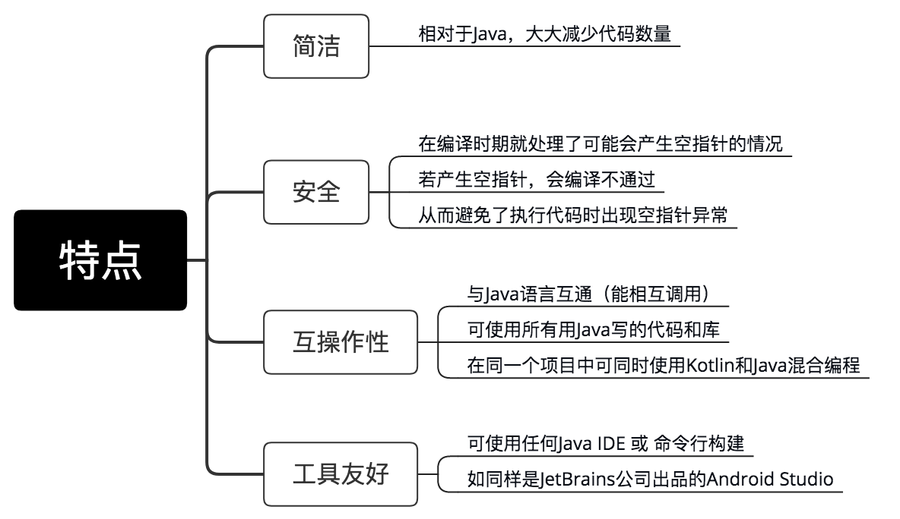

## 简介

### 定义

-   Android 应用开发的一级编程语言（Google 官方认证）
-   由 JetBrains 公司在 2010 年推出 & 开源，与 Java 语言互通 & 具备多种 Java 尚不支持的新特性
-   Android Studio3.0 后的版本支持 Kotlin

### 特点



## 基本语法

本节详细讲解 Kotlin 的基本语法，主要包括：

-   基本观念（对比于 Java）
-   数据类型
-   类
-   变量 & 常量
-   函数
-   其他语法糖（控制流、类型检查 & 转换、安全性等）

### 基本观念

在 Kotlin 中，有一些观念是和 Java 存在较大区别的，一些基本观念需要注意的：

-   操作对象：在 Kotlin 中，所有变量的成员方法和属性都是对象，若无返回值则返回 Unit 对象，大多数情况下 Uint 可以省略；Kotlin 中没有 new 关键字

-   数据类型 & 转换：在 Java 中通过装箱和拆箱在基本数据类型和包装类型之间相互转换；在 Kotlin 中，而不管是常量还是变量在声明是都必须具有类型注释或者初始化，如果在声明 & 进行初始化时，会自行推导其数据类型。

-   编译的角度：和 Java 一样，Kotlin 同样基于 JVM。区别在于：后者是静态类型语言，意味着所有变量和表达式类型在编译时已确定。

-   撰写：在 Kotlin 中，一句代码结束后不用添加分号 “；”；而在 Java 中，使用分号“;”标志一句代码结束。

### 数据类型

主要包括：

-   数值（Numbers）
-   字符（Characters）
-   字符串（Strings）
-   布尔（Boolean）
-   数组（Arrays）

#### a. 数值类型（Numbers）

Kotlin 的基本数值类型有六种：`Byte`、`Short`、`Int`、`Long`、`Float`、`Double`

|  类型  | 位宽度(Bit) |
| :----: | :---------: |
|  Byte  |      8      |
| Short  |     16      |
|  Int   |     32      |
|  Long  |     64      |
| Float  |     32      |
| Double |     64      |

::: tip
区别于 Java，在 Kotlin 中字符（char）不属于数值类型，是一个独立的数据类型。
:::

+ 补充说明：每种数据类型使用对应方法，可转换成其他数据类型

```
toByte()：Byte
toShort()：Short
toInt()：Int
toLong()：Long
toFloat()： Float
toDouble()：Double
toChar()：Char
```

#### b. 字符类型（Characters）

Kotlin中的字符类型采用 `Char` 表示，必须使用单引号 `'` 包含起来使用 `&` 不能直接和数字操作
